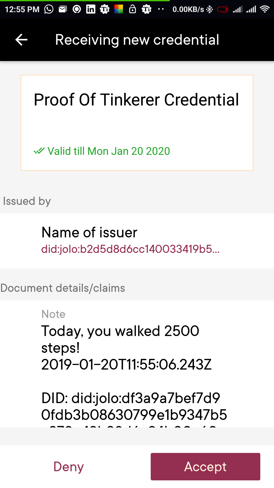
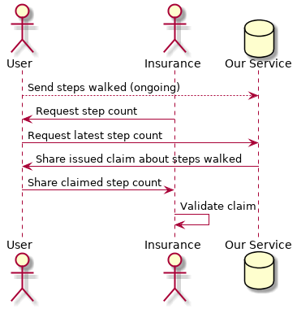

# HELIA #TLabsHack

Here we have all the code for team HELIA in the 2019 HackTlabsEvent



## Components and Data Flow



```
@startuml
actor "User" as U
actor "Insurance" as I
database "Our Service" as S

U --> S: Send steps walked (ongoing)
I -> U: Request step count
U -> S: Request latest step count
S -> U: Share issued claim about steps walked
U -> I: Share claimed step count
I -> I: Validate claim
@enduml
```

## Installation

- Install `docker` and `docker-compose`
- Run `git submodule update --init --recursive` to initialize all
  submodules
- Follow the installation instructions in the modules `ExpressApp`,
  `jolocom`, and `DLT`


## Usage

- Follow the instruction in the modules

